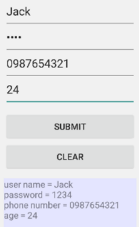

# UI Basic 點擊事件

Summit: 下方顯示輸入結果; Clear: 刪除

1. res/layout/activity_main:

	- 4x EditText: Name, Passwd, Phone#, Age

	(TextView: 文字; EditText: 供使用者編輯的文字塊)

	- android:layout_below="@id/....", 置於特定id物件下; android:layout_centerHorizontal="true": 置中

2. EditText內做hint, 提示文字需參照res/values/string.xml

3. res/layout/activity_main:
	
	- 2x Button: Submit, Clear

		2 ways

		- layout註冊onClick, 呼叫MainActivity中的OnSubmitClick()

		- MainActivity中註冊監聽器OnClickListener

	- TextView show Result

4. java/MainActivity: 

	- App畫面簡介 

	    `protected void onCreate(Bundle savedInstanceState) {`

	    //onCreate方法的參數是一个Bundle類型的參數, savedInstanceState保存Activity的狀態, (見Activity生命週期)

        `super.onCreate(savedInstanceState);`
    
        //用父類Activity的onCreate方法完成繪製畫面的工作。實現Activity子類的onCreate方法須用该方法，才能繪製畫面
    
        `setContentView(R.layout.activity_main);`
    
        `findViews();`

	    `}`

	- findview(), 以此方法方便後續管理, findViewById() 指定layout檔(,R=res)的UI元件, 並指派給對應物件

	- 註冊OnClickListener監聽器 (for Clear Button)

	    `btClear.setOnClickListener(new View.OnClickListener() {`
 
	    利用匿名內部類別實作 OnClickListener() 的 onClick()
  
            @Override
            public void onClick(View v) {
                etName.setText(null);
                略...
            }

        View v的參數v = 被按下的btClear鍵

        利用setText()傳遞null來清空內容

        `});`

    - 利用在layout註冊的onClick (for Submit Button)

    	`public void onSubmitClick(View view){`

		    String name = etName.getText().toString().trim();
		    略...

	        String text = "";
	        text += "User Name = " + name + "\n";
	        略...

	        tvMessage.setText(text);

	    onSubmitClick()須為public因為被layout檔呼叫, void回傳為View類型的參數

	    trim(): 回傳去除首尾空白符號的子字串

	    tvMessage.setText(text): 將文字顯示在tvMessage文字方塊

    	`}`

[Ref 1](https://sites.google.com/site/ronforwork/Home/android-2)

[Ref 2](http://blog.sina.com.cn/s/blog_7b83134b0101603x.html)