故障排除

## CH2

#### 2.1 系統負載

$ uptime

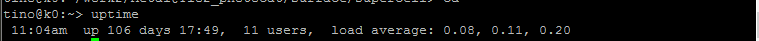

此行分別為:現在時間，系統存活時間，使用者人數，負載平均值

load average後三數: 1分鐘內, 5分鐘內, 15分鐘內機器平均負載

	1: 恆定負載
	0.2 : 系統負載 = 0.2*可承受負載值
	5 : 系統負載 = 5*可承受負載值, 4/5程序正等待資源

		負載類型
		- CPU密集型
		- I/O密集型
		- RAM密集型

#### 2.2 top

$ top -[bnd]

-b: batch file, 定期周期性的收集源文件
-n #: 更新#次
-d #: # ms 更新一次 

進入top後，常見命令
- ? 或 h - 顯示說明畫面。
- q - 離開 top。
- 【Space】或【Enter】 - 更新並重新繪畫整個畫面。
- M - 進程依記憶體使用率 (%MEM) 由大至小排列。
- T - 進程依總 CPU 時間 (TIME+) 由大至小排列。
- I - 在 Solaris 和 Irix 模式切換，改變 CPU 使用率的計算方法。預設一般為 Irix 模式，
- K - 終止某個進程。
- r - 改變進程 nice 值，影響進程的優先序。

$ top

即時顯示系統中各個進程的資源佔用狀況

概要區 (Summary Area) 前五行: 當前系統情況整體統計資訊區

	1. 現在時間，存活時間，使用者人數，負載平均值
	2. Task: 共有291個進程，運行中1個，休眠（sleep）289個，stoped狀態0個，zombie狀態（僵屍）的有0個。
		zombie:
	3. cpu狀態資訊
		- us: user所佔CPU
		- sy: sys.所佔CPU
		- ni: nice, 優先process所佔CPU
		- id: (idle,空閒)free CPU
		- wa: (iowait)I/O所佔CPU, 判斷是否"I/O密集型負載"重要依據
		- hi: CPU 處理硬體中斷時間的百分比
		- si: CPU 處理軟體中斷時間的百分比
		- st: (steal)虛擬環境下 CPU 運作虛擬機器時間的百分比

	4,5. 記憶體和置換空間使用率
		- buffers (緩衝區) 表示被使用作磁碟寫入快取 (write cache) 的記憶體大小。當有磁碟控制卡有時間或系統記憶體不夠時，自然會把 buffers 上的資料清出 (flush) 至磁碟並釋放有關記憶體。過大 buffers (超過幾百 MB) 一般表示儲存子系統有問題，令 buffers 上的資料無法清出。

		- cache (快取) 則表示被使用作檔案讀取快取 (read cache) 的記憶體大小。同樣在統記憶體不夠時，部份 cache 使用的記憶體會被釋放。當系統正進行大量讀取工作，此值效高是很自然和良好的現像。但如果此值在有大量讀取工作時過低 (少於總記憶體大小的四成)，這表示系統到了需要增加記憶體的時候。

任務區 (Task Area): 依CPU使用率大至小，顯示耗用系統資料

	PID
	USER
	PR: process的優先值, 20~-19,越小優先序越高
	NI: nice值
	VIRT: 使用總虛擬記憶體大小,單位KiB(1KiB = 1,024Byte), VIRT= SWAP + RES
	RES: resident size, 實體記憶體大小, RES = CODE + DATA
	SHR: shared MEM size): 共用記憶體大小
	S: stats
		D: (uninterruptible sleep) - 在不可中斷的休眠中 (一般為正在進行輸入/輸出)
		R: 在運行中或可以被運行 (即在運行序列 run queue)
		S: (sleeping) - 在可以被中斷的休眠中 (一般是正在等待某事件完結)
		T: (traced or stopped) - 已被停止。因工作控制訊號 (job control signal) 或進程在被追蹤中。
		Z: (Zombie) - 不能運作的進程，即所謂 zombie 進程。一般因為已終止但未能被其母進程成功接收的進程。
	%CPU: CPU usage
	%MEM: Memory usage 
	TIME+: CPU Time,由進程被啟動至今的總 CPU 時間
	COMMAND: Command line or Program name

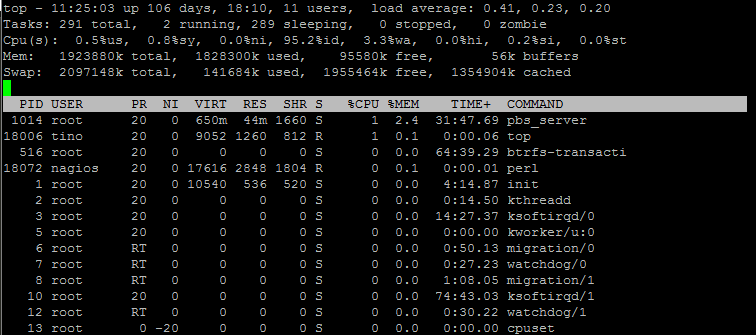

###### 解決RAM不足問題

1. $top > M , 打開top,依%MEM大至小排列
2. K > 輸入PID, kill it

Linux kernel 具有 out-of-memory (OOM) killer 當RAM過低導致系統運行危險，自動刪除process，若OOM介入可在/var/log/syslog中看到

	1228419127.32453_1704.hostname:2,S:out of Memory: Killed process 21389 (java)
	1228419127.32453_1710.hostname:2,S:out of Memory: Killed process 21389 (java)

###### 解決I/O等待時間問題

$ iostat

1. CPU屬性:

	- %user：CPU處在用戶模式下的時間百分比。
	- %nice：CPU處在帶NICE值的用戶模式下的時間百分比。
	- %system：CPU處在系統模式下的時間百分比。
	- %iowait：CPU等待輸入輸出完成時間的百分比。
	- %steal：管理程式維護另一個虛擬處理器時，虛擬CPU的無意識等待時間百分比。
	- %idle：CPU空閒時間百分比。

2. Disk屬性:

	- tps: 每秒傳輸量
	- Blk_read/s: 每秒從設備讀取量
	- Blk_write/s: 每秒設備寫入量
	- Blk_read: 從設備讀取量
	- Blk_rwrute: 設備寫入量
	 

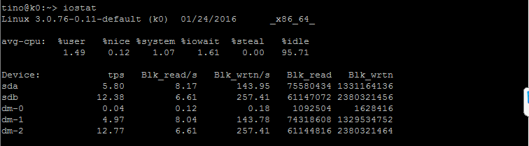

看出是輸入or讀取操作的問題

$ iostat -x :顯示詳細資料

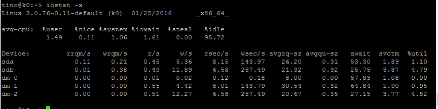

$ iostat [-c|-d] [-k|-m] [-t] [間隔秒數] [偵測次數]
	
	-c  ：僅顯示 CPU 的狀態；
	-d  ：僅顯示儲存設備的狀態，不可與 -c 一起用；
	-k  ：預設顯示的是 block ，這裡可以改成 K bytes 的大小來顯示；
	-m  ：與 -k 類似，只是以 MB 的單位來顯示結果。
	-t  ：顯示日期出來；

#### 2.3 全天系統負載記錄檔

Sysstat

監測系統性能及效率的一組工具, 收集系統性能數據，ex: CPU使用率,硬碟和網絡傳輸數據,依數據的收集和分析,利於我們判斷系統是否正常運行,提高系統運行效率、安全運行服務器

工具(常用):
	iostat: CPU, I/O
	sar: 收集、報告並存儲系統活躍的信息

安裝sysstat

	$ YaST -i sysstat
	or
	$ yum install sysstat

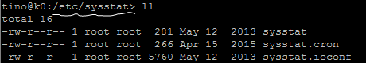

啟動sysstat

	$ /etc/init.d/sysstat start

更動循環時間

	$vi /etc/cron.d/sysstat
	or
	$vi /etc/sysstat/sysstat.cron

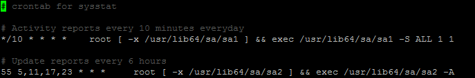

$ sar: CPU統計訊息

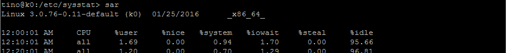
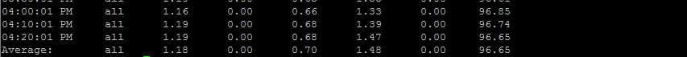

$ sar -r: RAM統計訊息

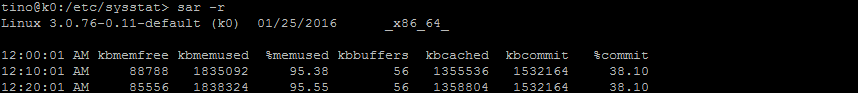
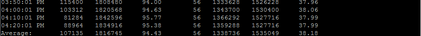

$ sar -b: I/O統計訊息

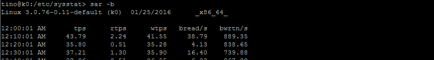
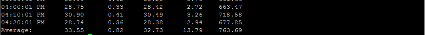

$ sar -s [time] -e [time2]: 看特定時段

## CH3

## CH4

## CH5

## CH6

## CH7

## CH8

## CH9

## CH10