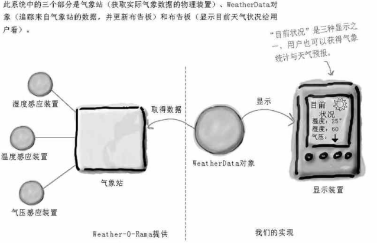
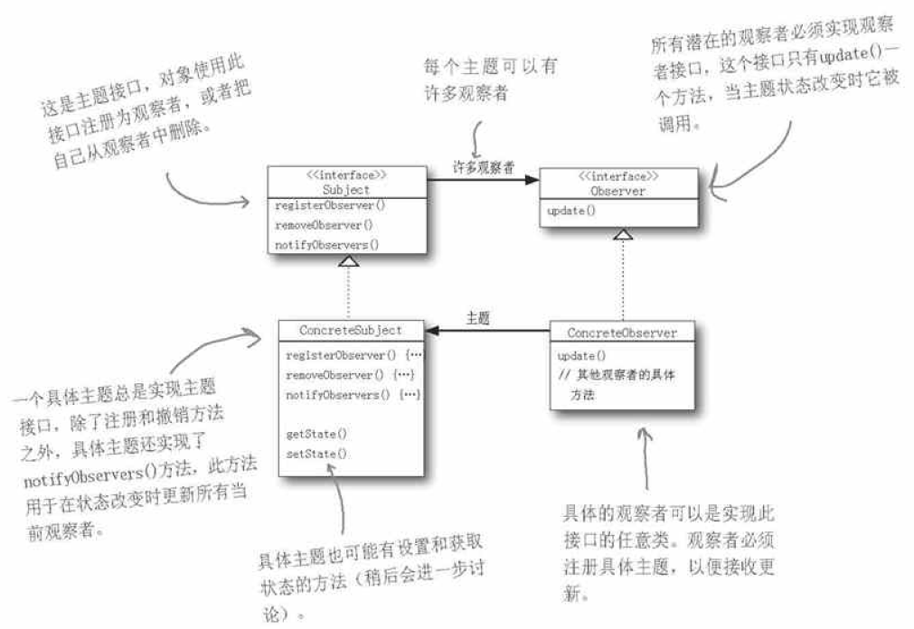

# 觀察者模式

目標: 氣象觀測站

### 設計一

1. 創WeatherData類別(./Design1/src/main/java/WeatherData), 模擬氣象站資料, 溫度,濕度,壓力, 以measurementsChanged方法得到資料

2. 3x 顯示資料類別: 目前狀況, 預報, 天氣統計包有顯示與更新氣象站資料的method (./Design1/src/main/java/CurrentConditionsDisplay, ./Design1/src/main/java/ForecastDisplay, ./Design1/src/main/java/StatisticsDisplay)

缺點:

1. 針對實踐寫程式, 新的display都需再改程式

2. 執行期間無法動態增加刪除display

3. 沒封裝

### 設計二, 觀察者模式

1. 製作2個介面: Subject, Observer

2. 創WeatherData類別為具象主題ConcreteSubject, 三個Display資料類別為ConcreteObserver, 分別繼承介面: Subject, Observer

3. Subject提供註冊,移除,告知Observer的方法, WeatherData(=ConcreteSubject), 實踐並加上measurementsChanged方法得到資料

4. WeatherData內的註冊觀察者使之成為ArrayList: ArrayList<Observer> observers = new ArrayList();

5. ConcreteObserver實作，實踐Observer, DisplayElement

6. 測試程式

優點:

1. Observer依賴Subject來更動, 一個Subject更動, 相關的Observer能一起變更

2. Observer跟Subject鬆綁，有新Observer時,Subject不須更動

