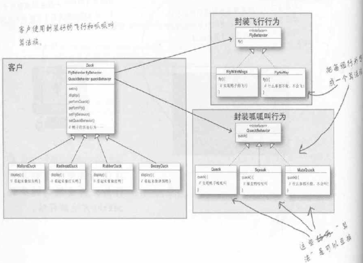

# SimUDuck Note

### 鴨子設計一, 繼承 extend

1. 設計鴨子superclass(./duck/src/Duck.java), 
	
	- 呱呱叫 quack()

	- 游泳 swim()

	- 顯示外觀 display()

	- 飛 fly()

2. 各式各樣的鴨子(紅頭, 綠頭, 塑膠, 誘餌)都繼承鴨子superclass,

3. 測試鴨子們

	塑膠鴨, 誘餌鴨也會飛、叫, 需要去個別class修改,推翻。

缺點: 

1. 程式碼在次類別中重複

2. 無法在次類別新增功能(當誘餌(), 塑膠融化())

3. 難以得知所有鴨子全部行為

### 鴨子設計二, 介面 interface

1. 設計鴨子superclass(./Duck2/src/Duck.java), 

2. 各式各樣的鴨子(紅頭, 塑膠)都繼承鴨子superclass,

3. 利用interface(以形容詞命名), 將特別功能獨立抽出, 個別class有需要再implements

缺點: 

1. 程式碼無法再利用, interface只將行為抽出, 每次使用仍需定義

## 鴨子設計三, 封裝

1. 設計鴨子superclass(./Duck3/src/Duck.java),

2. 各式各樣的鴨子(紅頭, 綠頭, 塑膠)都繼承鴨子superclass,

3. 做interface，同一個interface包含實踐了行為的類別們

	- 飛行interface, 包含2種飛行為class(FlyNoWay, FlyWithWings)

	- 呱呱叫interface, 包含2種呱呱行為class(Quack, Squeak)

4. 測試鴨子們
