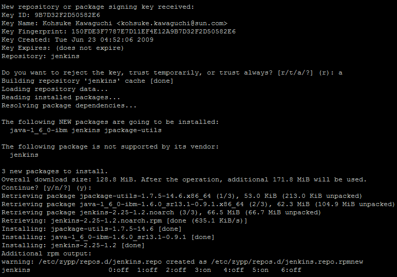
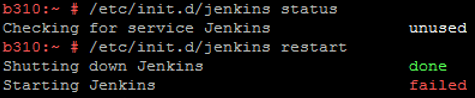
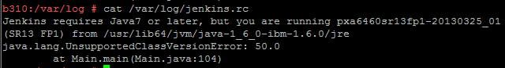
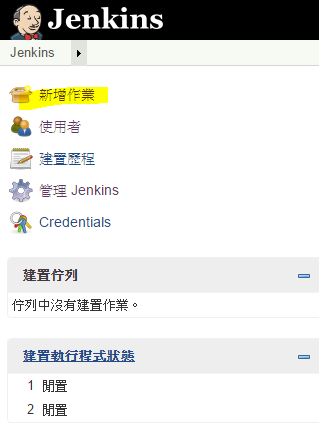
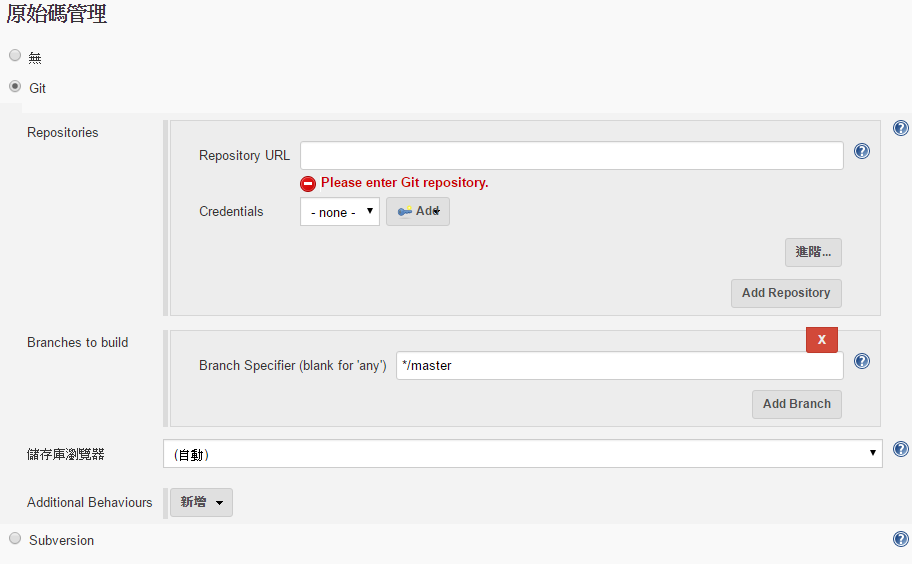
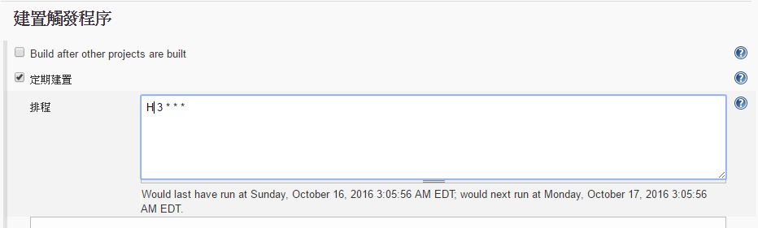
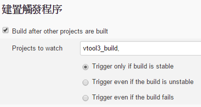
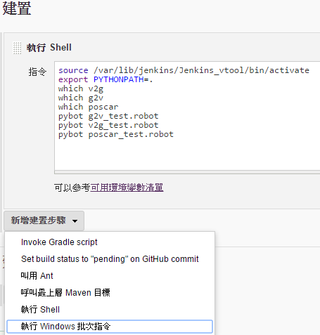
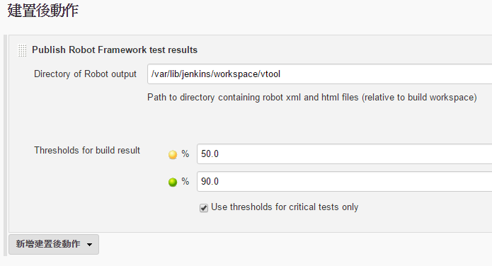

# Jenkins

### Setup(SLES11SP3)

Check Apache, Jenkins Server or Install it.

`chkconfig | grep apache2(, jenkins)`

`zypper in apache2`, `/etc/init.d/apache2 start`

`zypper addrepo http://pkg.jenkins-ci.org/opensuse/ jenkins`

`zypper in jenkins`

啟動失敗, 安裝Java7或以上

`zypper in java-1_7_0-ibm`, `/etc/init.d/jenkins restart`

瀏覽器開啟: ip_addr:8080 (default port:8080)

根據網頁指示設置 

設定Jenkins所需要的權限

`vim /etc/sudoers`

`jenkins ALL=(ALL) NOPASSWD: ALL`

### Build

建置作業

原始碼管理(連結git)

觸發, 上下游

執行指令(以shell cmd為例)

### Robotframework + Jenkins

管理Jenkins > 管理外掛程式 > 下載Robot Framework plugin

修改作業"建置後動作"

