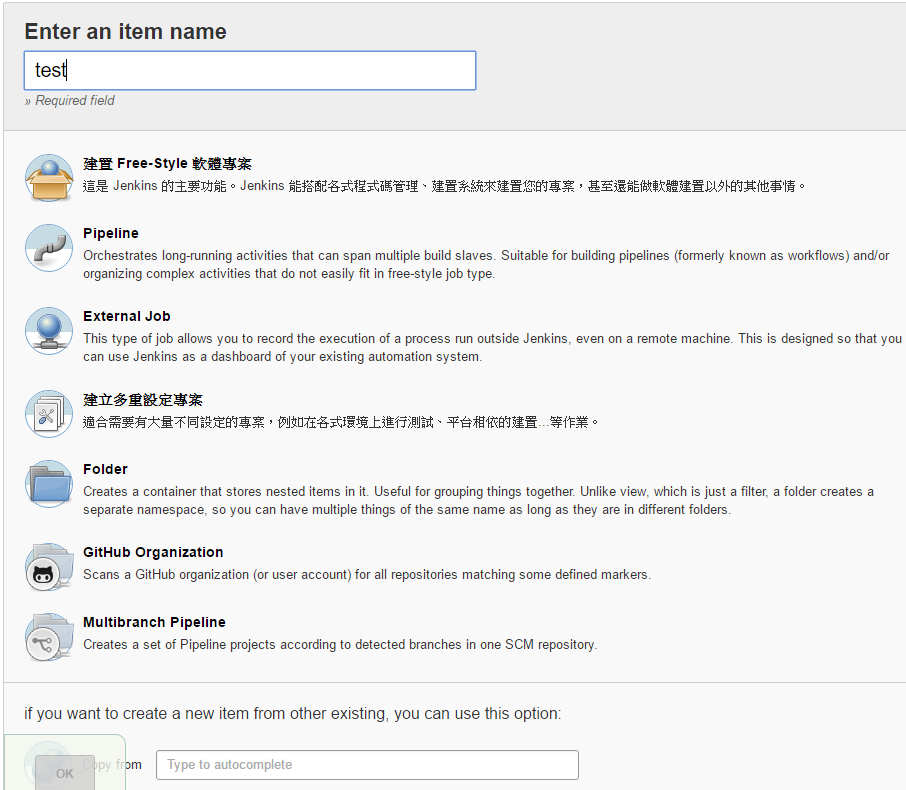

# Jenkins

### Setup(SLES11SP3)

Check Apache, Jenkins Server or Install it.

`chkconfig | grep apache2(, jenkins)`

`zypper in apache2`, `/etc/init.d/apache2 start`

`zypper addrepo http://pkg.jenkins-ci.org/opensuse/ jenkins`

`zypper in jenkins`

啟動失敗, 安裝Java7或以上

`zypper in java-1_7_0-ibm`, `/etc/init.d/jenkins restart`

瀏覽器開啟: ip_addr:8080 (default port:8080)

根據網頁指示設置 

設定Jenkins所需要的權限

`vim /etc/sudoers`

`jenkins ALL=(ALL) NOPASSWD: ALL`

### Build

建置作業

原始碼管理(連結git)

觸發, 上下游

執行指令(以shell cmd為例)

### Robotframework + Jenkins

管理Jenkins > 管理外掛程式 > 下載Robot Framework plugin

修改作業"建置後動作"

### ShiningPanda plugin

提供Virtualenv Builder, Custom Virtualenv Builder and Standard Python Builder

可用於創建虛擬環境和使用不同版本的python

[Shiningpanda官方文件](http://shiningpanda.com/shiningpanda-plugin-for-jenkins-ci.html)

設定版本:

Global Tool Configuration > Python安裝 (可選不同版本)

### MultiJob Plugin

提供多工作並行,串行執行

[MultiJob](https://wiki.jenkins-ci.org/display/JENKINS/Multijob+Plugin)

新增作業 > Multijob Project

### EnvInject

傳遞不同job,task間變數

example: 傳遞ShiningPanda虛擬環境路徑位置

job1: 創造ShiningPanda虛擬環境 & 將環境路徑位置寫入變數檔案

`echo VIRTUAL_ENV=$(echo $VIRTUAL_ENV) > /var/lib/jenkins/workspace/vtool3/envVars`

job2: 讀取變數檔案 即可使用其中變數

### 使用python變數

