# 架設LAMP on sles11 

- Go YaST Ctrl Center

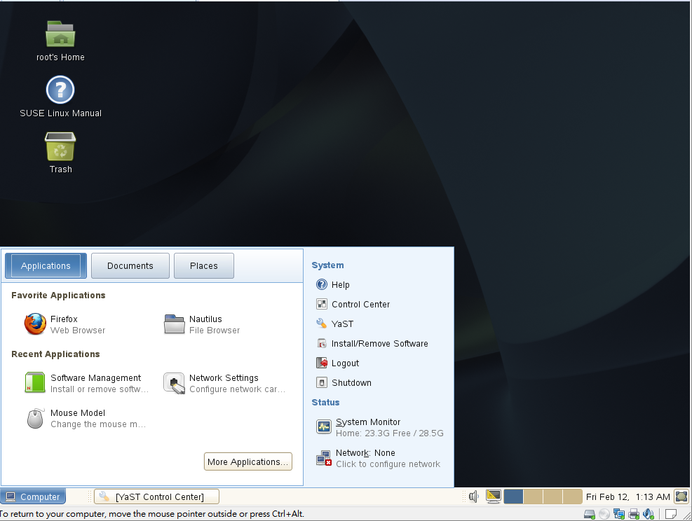

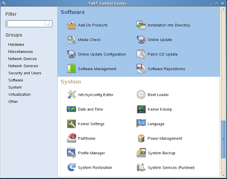

- Software Manager Center; 點View > Patteren > 選擇 Web & LAMP server

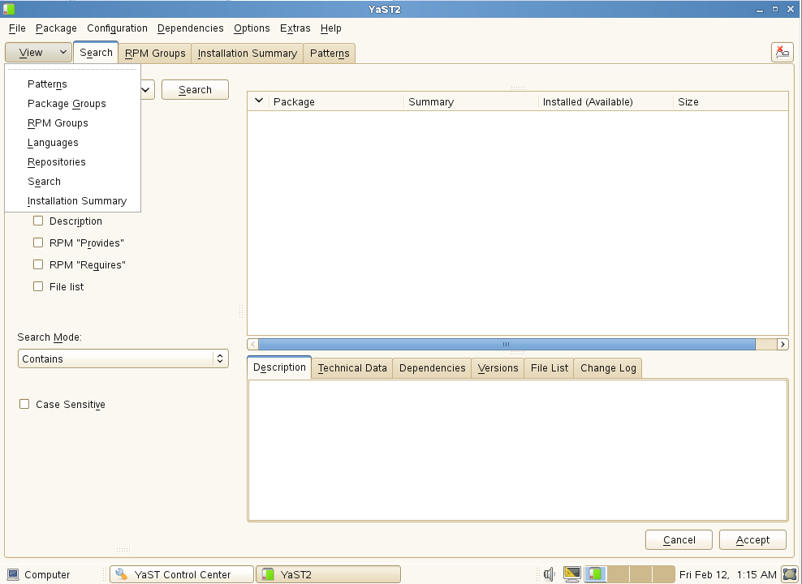

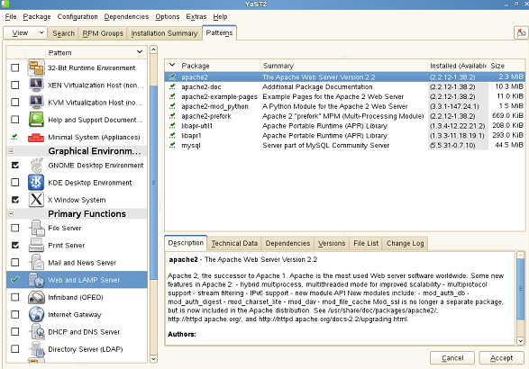

(ps 需掛載上光碟, 以虛擬機為例)

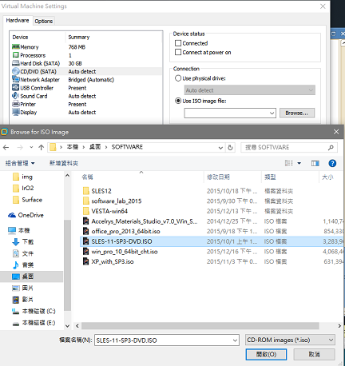

- 裝PHP, 用search額外安裝

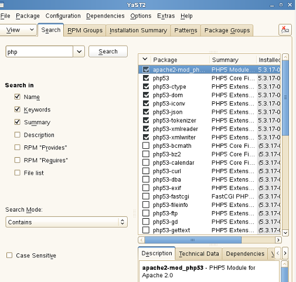

- 開啟服務

開啟apache

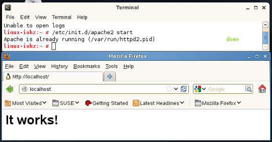

開啟&設置 Mysql 

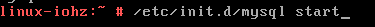

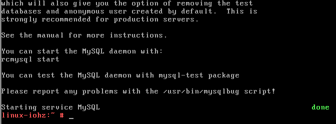

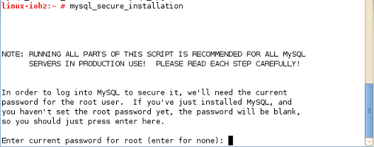

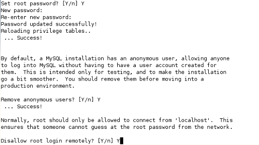

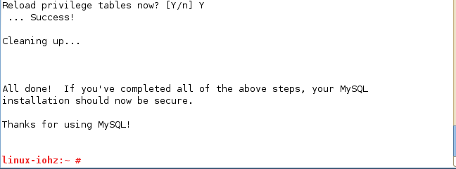

做測試檔

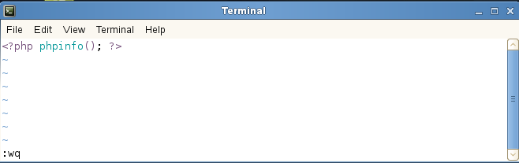

由瀏覽器開啟

- firefox 打不開php

- Help > Troubleshooting Information > Profile Directory: Show Folder

Try to delete the mimeTypes.rdf file in the Firefox Profile Folder to reset all file actions.

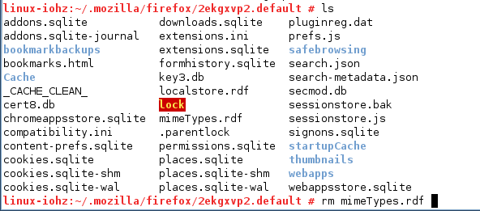

- 包在html中

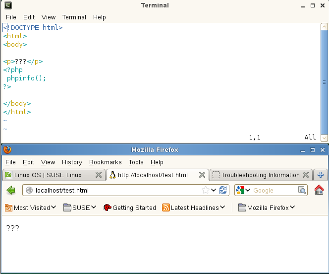

[LAMP教學影片](https://www.youtube.com/watch?v=iUpNHQDyy0Q)
[VBird_伺服器ch20](http://linux.vbird.org/linux_server/0360apache.php#whatis_www_lamp)