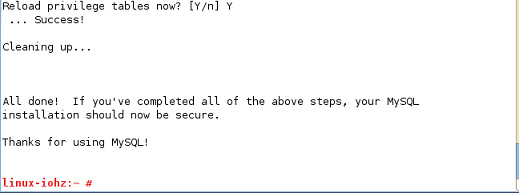

# 架設LAMP on sles11 

1. Go YaST Ctrl Center

2. Software Manager Center; 點View > Patteren > 選擇 Web & LAMP server

(ps 需掛載上光碟, 以虛擬機為例)

3. 開啟服務

開啟apache

開啟&設置 Mysql 

做測試檔

4. firefox 打不開php

Help > Troubleshooting Information > Profile Directory: Show Folder

Try to delete the mimeTypes.rdf file in the Firefox Profile Folder to reset all file actions.

