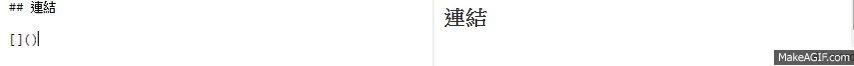

Markdown note

# 區塊

## 段落換行

段落: 中間需插入空行  
換行: 行尾加上兩個以上的空白，然後按enter

## 標題

# h1h1h1h1h1
## h2h2h2h2h2
###### (略)
###### h6h6h6h6h6h6

	# h1h1h1h1h1
	## h2h2h2h2h2
	(略)
	###### h3h3h3h3h3h3

## 清單

- 1st
- 2st
- 3rd

	\- 1st
	\- 2nd
	\- 3rd

1. 1st
2. 2st
3. 3rd

	\1. 1st
	\2. 2nd
	\3. 3rd

## 分隔線

===

	三個以上的"="

# 區段元素

## 連結

	[文字](連結網址)

[links to google](www.google.tw)

	<自動連結網址>: 文字同連結網址

## 強調

_斜體_  *斜體*  
__粗體__ **粗體**

	_斜體_  *斜體*  
	__粗體__ **粗體**

可用反斜線跳脫, ex \*\*粗體** \*斜體*

	\*\*粗體** \*斜體*

## 程式碼

`your code`

	`your code` 反引號

## 圖片

	, 比"連結"前面多驚嘆號

## 表格

| Tables   |      Are      |  Cool |
|----------|:-------------:|------:|
| col 1 is |  left-aligned | $1600 |
| col 2 is |    centered   |   $12 |
| col 3 is | right-aligned |    $1 |

	| Tables   |      Are      |  Cool |
	|----------|:-------------:|------:|
	| col 1 is |  left-aligned | $1600 |
	| col 2 is |    centered   |   $12 |
	| col 3 is | right-aligned |    $1 |

[參考網址1](http://markdown.tw/)
[參考網址1](http://www.tablesgenerator.com/markdown_tables)