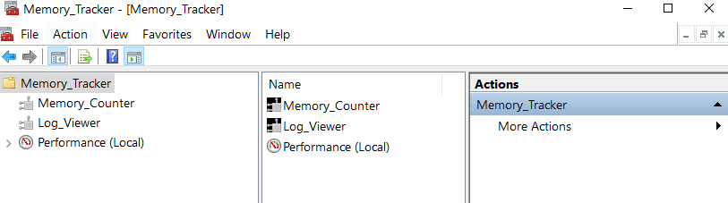
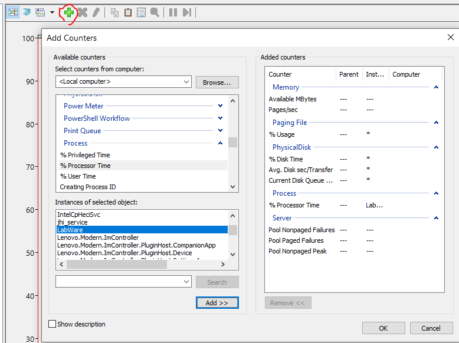

# MS WINDOWS

## Microsoft Management Console - Memory Tracker console

### Open MMC

Win + R

Type mmc

File > Save... > name the console Memory_Tracker.msc

right click Console Root folder > rename folder Memory_Tracker

MMC setting located at:

C:\Users\{user_name}\AppData\Roaming\Microsoft\Windows\Start Menu\Programs\Administrative Tools

### Add Snap-in

Add/Remove Snap-in

Add ActiveX control > ActiveX control Opened > Next

Choose System Monitor Control > Name Memory_Counter

Repeat > Name Log_Viewer

Add Performance Monitor

### Add counters

Click add button or Ctrl + I

Add counters in picture

### Monitoring

#### Change duration

Right click at panel > General > Graph elements

Sample every: 1 secs; Duration: 1000 secs

(Duration/Sample every: 2~1000)

#### Rescale each counter

### Studying

#### Memory

Available Mbytes: physical memory, Average and Minimum boxes > 4MB (optimal)

Pages/sec: the number of pages being read from or written to virtual memory, Average and Maximum boxes < 20

#### Server

Pool Nonpaged Failures & Pool Paged Failures: the number of times that the operating system couldn’t find any available memory

Pool Nonpaged Peak: maximum size (in bytes) of the nonpaged pool

#### Paging File

SWAP(Linux)

#### Physical Disk

## VMMAP

[VMMAP Download](https://docs.microsoft.com/en-us/sysinternals/downloads/vmmap)

A Sysinternals utility to monitor memory usage.

Display memory allocations by type
