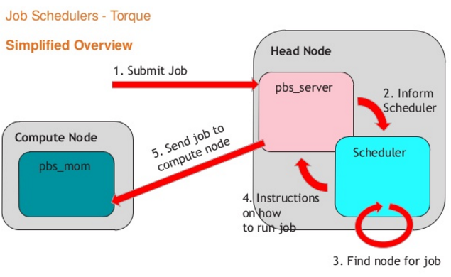

# PBS

- _**Portable Batch System**, SW for job scheduling, 排程系統_  
- _常使用在 UNIX cluster environments_

#### Versions

三的版本為大宗
- OpenPBS
- TORQUE, _**T**erascale **O**pen-source **R**esource and **QUE**ue Manager_
- PBS Professional

### Components

- Job Server (**pbs_server**): 接收jobs summit by user, 提供mom資訊給user 
- Job Executor (**pbs_mom**): 執行job的主機，依queue type去安排job所使用的時間，使用mom的數量
- Job Scheduler (**pbs_server**): 接收sever中的jobs

