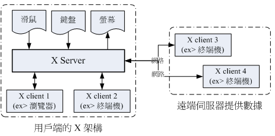
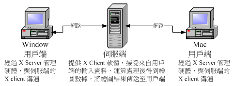

# X WINDOW SYSTEM

## X window system

### X server/X Client/Window Manager/Display Manager

	大部分distribution由Xorg基金��提供的X11���w
	MIT授��,GPL�_放原始�a

##### X Server

	硬�w管理: �I�P,滑鼠,�@示器,�@卡......
	�⑤�入�b置的�幼鞲嬷�Client 

##### X Client

	����X server要求事件之��理

##### X Window Manager

	管理所有X clients
	- 提供控制元素，如工作列、背景桌面的�O定等等；
	- 管理���M桌面 (virtual desktop)；
	- 提供��窗控制���担��@包括��窗的大小、��窗的重�B�@示、��窗的移�印⒁�窗的最小化等等。
	ex: GNOME, KDE, twm, XFCE

##### Display Manager

	提供登入需求,�d入user's�Z系等�Y料
	
### X window ���恿鞒�

#### �B哥的linux私房菜
(http://linux.vbird.org/linux_basic/0590xwindow.php)
